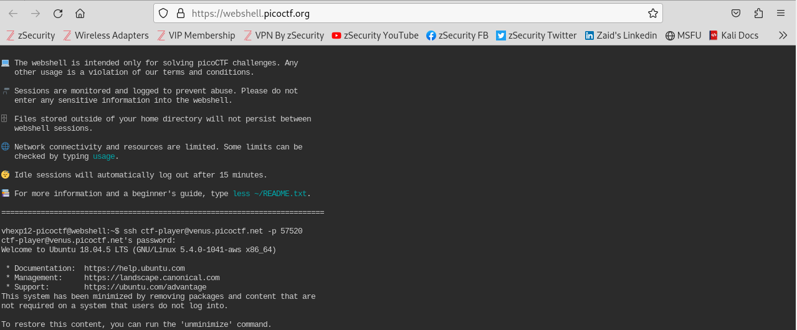
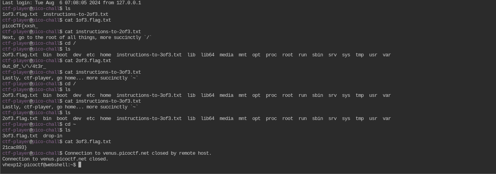

# Author: syreal
# Description:
Do you know how to move between directories and read files in the shell? Start the container, `ssh` to it, and then `ls` once connected to begin. Login via `ssh` as `ctf-player` with the password, `abcba9f7`
Additional details will be available after launching your challenge instance.
# Hints:
Finding a cheatsheet for bash would be really helpful!
# Solutions:
Sử dụng ssh để truy cập dữ liệu và tìm ra Flag.
## Thực hiện như sau:
1. Mở đường dẫn sau https://webshell.picoctf.org/, sau đó dán đoạn này vào *ssh ctf-player@venus.picoctf.net -p 57520*, rồi nhập password: *abcba9f7*. Như dưới đây là thành công vào hệ thống.
   
2. Dùng lệnh *ls* để xem các file có trong hệ thống:

3. Ta thấy 2 file đuôi *.txt*, thực hiện lệnh *cat* để xem nội dung của chúng:

4. Theo thứ tự thì khi ta mở được 1 file *.flag.txt* thì trong đó sẽ kèm thêm 1 file *.instructions-to* để có thể tìm nốt nội dung của flag.

# Flag:
> `picoCTF{xxsh_0ut_0f_\/\/4t3r_21cac893}`