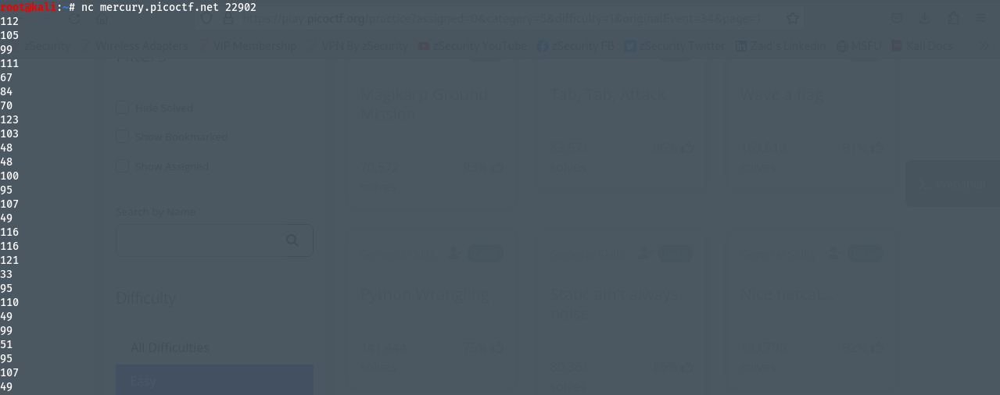
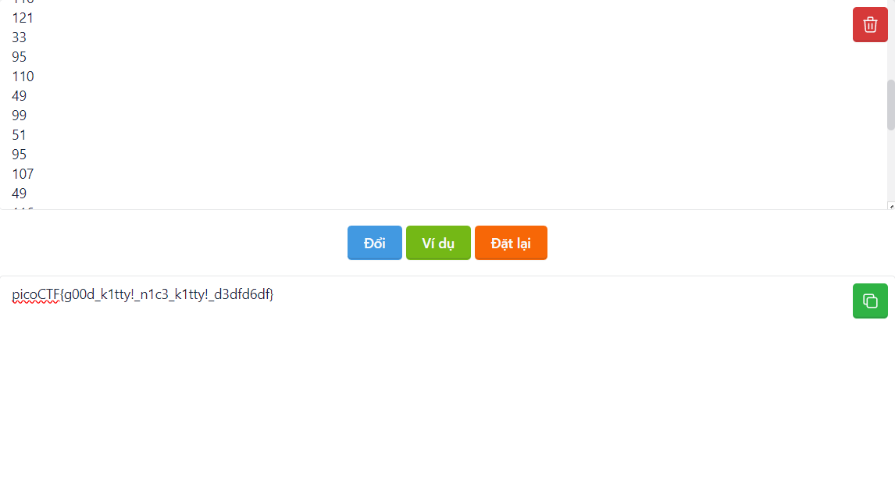

Photos/# Author: syreal
# Description:
There is a nice program that you can talk to by using this command in a shell: $ nc mercury.picoctf.net 22902, but it doesn't speak English...
# Hints:
1. You can practice using netcat with this picoGym problem: what's a netcat?
2. You can practice reading and writing ASCII with this picoGym problem: Let's Warm Up
# Solutions:
## Thực hiện như sau:
1. Chạy câu lệnh `nc mercury.picoctf.net 22902`, ta được một chuỗi ASCII như sau:

2. Vậy ta sẽ có ý tưởng là chuyển chuỗi ASCII trên thành text để có được Flag, ta sẽ dùng tool trên link sau `https://atpsoftware.vn/freetools/ascii-to-text`, và kết quả như sau:

# Flags:
> `picoCTF{g00d_k1tty!_n1c3_k1tty!_d3dfd6df}`