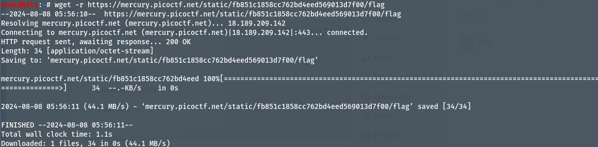
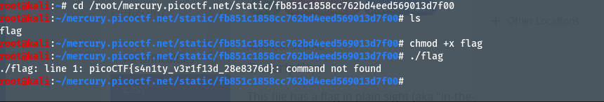

# Author: syreal
# Description:
This file has a flag in plain sight (aka "in-the-clear"). `Download flag`.
# Hints:
1. Any hints about entering a command into the Terminal (such as the next one), will start with a '$'... everything after the dollar sign will be typed (or copy and pasted) into your Terminal.
2. To get the file accessible in your shell, enter the following in the Terminal prompt: $ wget https://mercury.picoctf.net/static/fb851c1858cc762bd4eed569013d7f00/flag
3. $ man cat
# Solutions:
## Thực hiện như sau:
1. Tải file về với lệnh `wget -r https://mercury.picocPhotos/tf.net/static/fb851c1858cc762bd4eed569013d7f00/flag`

2. Truy cập location và cập quyền cho file `flag`, thực thi file `flag`, ta được kết quả:

# Flag:
> `picoCTF{s4n1ty_v3r1f13d_28e8376d}`