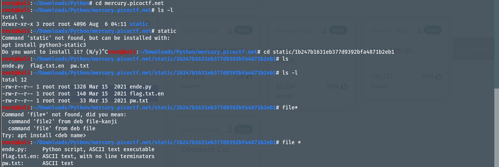
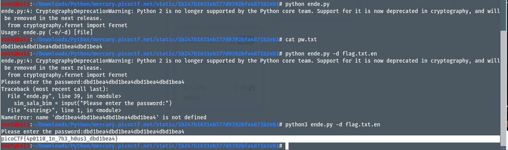

# Author: syreal
# Description
Python scripts are invoked kind of like programs in the Terminal... Can you run this Python script using this password to get the flag?
# Hints:
1. Get the Python script accessible in your shell by entering the following command in the Terminal prompt: $ wget https://mercury.picoctf.net/static/1b247b1631eb377d9392bfa4871b2eb1/ende.py
2. man python
# Solutions:
Tải các file và thực thi file `.py`.
Thực hiện như sau:
1. Tải 3 file bằng các lệnh sau:
- `ende.py`:wget -r https://mercury.picoctf.net/static/1b247b1631eb377d9392bfa4871b2eb1/ende.py
- `pw.txt`: wget https://mercury.picoctf.net/static/1b247b1631eb377d9392bfa4871b2eb1/pw.txt
- `flag.txt.en`:wget https://mercury.picoctf.net/static/1b247b1631eb377d9392bfa4871b2eb1/flag.txt.en 

2. Ta thực thi file ende.py, sau đó hiện ra Usage để `run` đúng lệnh là `ende.py (-e/-d) [file]`, ta dùng lệnh `python3 ende.py -d flag.txt.en`, tiếp theo, nó sẽ yêu cầu password, nội dung của password nằm trong file `pw.txt`, để xem nội dung ta dùng lệnh `cat [file]`. Và đây là kết quả:

# Flag:
> `picoCTF{4p0110_1n_7h3_h0us3_dbd1bea4}`