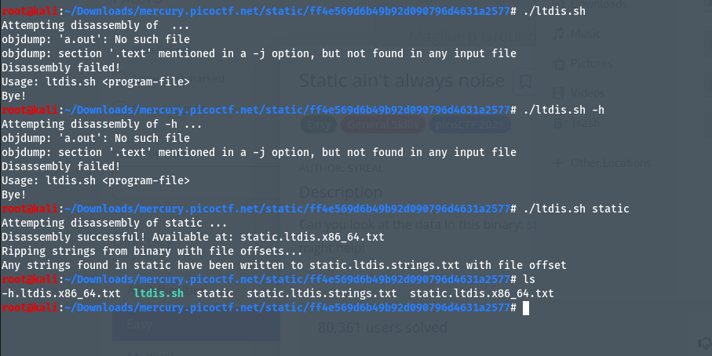
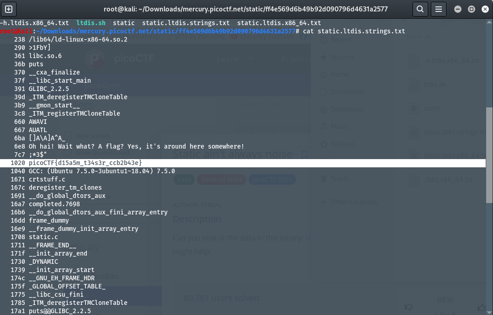

# Author: syreal
# Description
Can you look at the data in this binary: `static`? This `BASH` script might help!
# Hints
None
# Solutions:
## Thực hiện như sau:
1. Đầu tiên, ta tải 2 file từ trang web bằng câu lệnh
- `static` : wget -r https://mercury.picoctf.net/static/ff4e569d6b49b92d090796d4631a2577/static
- `BASH file` : wget -r https://mercury.picoctf.net/static/ff4e569d6b49b92d090796d4631a2577/ltdis.sh
2. Tiếp theo, truy cập location của 2 file và thực hiện cấp quyền `chmod +x [file]`.
![alt text]Photos/image-7.png)
3. Ta thực thi file `ltdis.sh`, và hiện ra Usage: `ltdis.sh <program-file>` , ở đây `program-file` là `static`

4. Dùng lệnh `cat` để xem nội dung của 2 file vừa tạo, trong đó xuất hiện Flag.

# Flag
> `picoCTF{d15a5m_t34s3r_ccb2b43e}`
