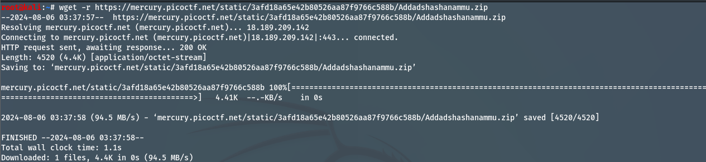
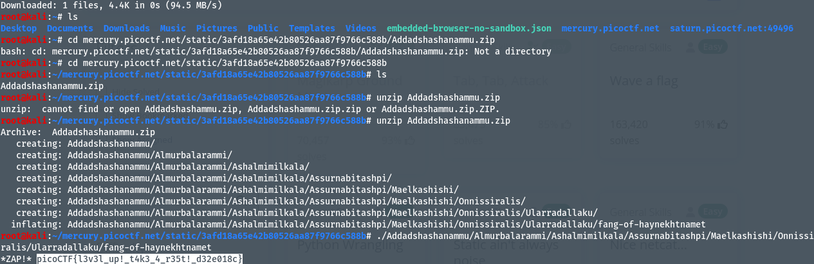

# Author: syreal
# Description:
Using tabcomplete in the Terminal will add years to your life, esp. when dealing with long rambling directory structures and filenames: `Addadshashanammu.zip`
# Hints:
After `unzip`ing, this problem can be solved with 11 button-presses...(mostly Tab)...
# Solutions:
Thực hiện tải file `.zip`, giải nén, mở và thực thi file cuối cùng.
## Thực hiện như sau:
1. Tải file zip bằng terminal bằng lệnh: wget -r https://mercury.picoctf.net/static/3afd18a65e42b80526aa87f9766c588b/Addadshashanammu.zip :

2. Tiến hành unzip, sau đó ta sẽ thấy file `fang-of-haynekhtnamet`, nếu chưa cấp quyền `run`, ta dùng lệnh `chmod +x fang-of-haynekhtnamet` và ta được kết quả:

# Flag:
> `picoCTF{l3v3l_up!_t4k3_4_r35t!_d32e018c}`