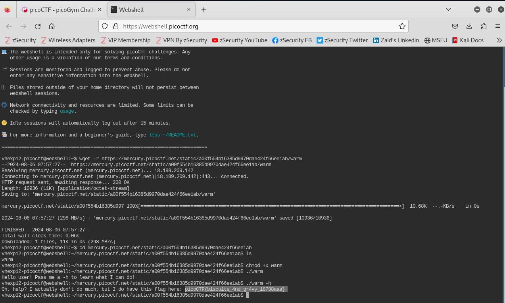

# Author: syreal
# Description:
Can you invoke help flags for a tool or binary? This program has extraordinarily helpful information...
# Hints:
1. This program will only work in the webshell or another Linux computer.
2. To get the file accessible in your shell, enter the following in the Terminal prompt: $ wget https://mercury.picoctf.net/static/a00f554b16385d9970dae424f66ee1ab/warm
3. Run this program by entering the following in the Terminal prompt: `./warm`, but you'll first have to make it executable with `chmod +x warm`
4. `-h` and `--help` are the most common arguments to give to programs to get more information from them!
5. Not every program implements help features like -h and --help.
# Solutions:
Thực hiện theo Hints và ta có kết quả như sau:

# Flag:
> `picoCTF{b1scu1ts_4nd_gr4vy_18788aaa}`