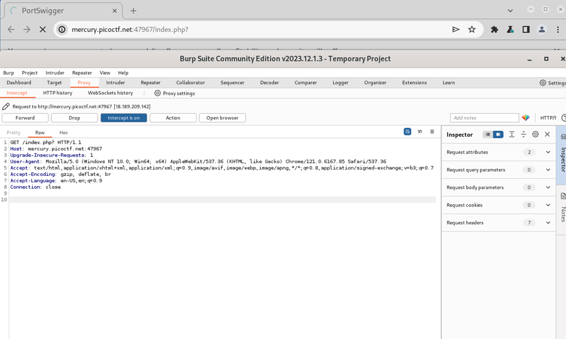
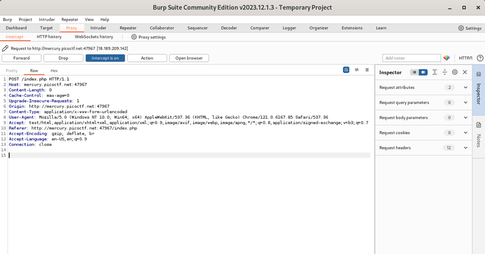
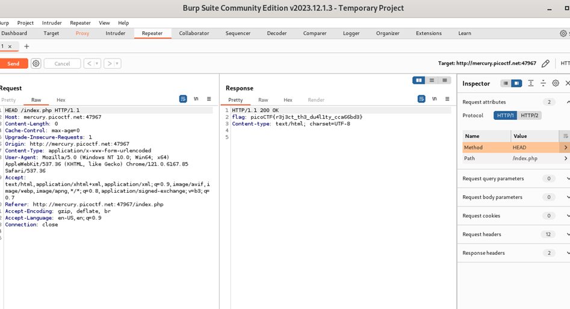

# Author: MADSTACKS
# Description:
Find the flag being held on this server to get ahead of the competition http://mercury.picoctf.net:47967/
# Hints:
1.	Maybe you have more than 2 choices
2.	Check out tools like Burp Suite to modify your requests and look at the responses
# Solutions:
Từ hai lựa chọn là Red hoặc Blue liên quan đến phương thức GET và POST, gửi yêu cầu đến trang web. Từ gợi ý của tên thử thách, chúng ta có thể kết luận rằng ta sẽ gửi một yêu cầu HEAD đến trang web để tìm ra flag. 
## Thực hiện như sau:
1.	Thực hiện Inspector trong Burp Suite:

2.	Thực hiện Forward, chọn “choose Blue” để xuất hiện phương thức POST

3.	Sau khi xuất hiện POST, ta chuyển đến Repeater để sửa POST thành HEAD, rồi gửi yêu cầu đến trang web. Sau đó, Flag xuất hiện ở phần Response.

**FLAG:**
> `picoCTF{r3j3ct_th3_du4l1ty_cca66bd3}`
