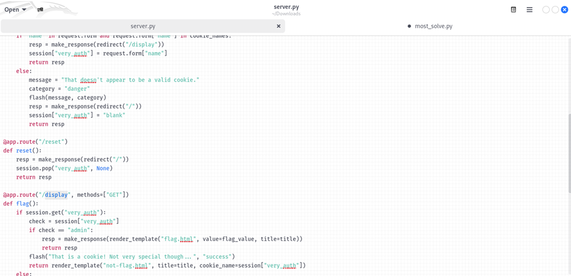
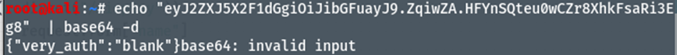
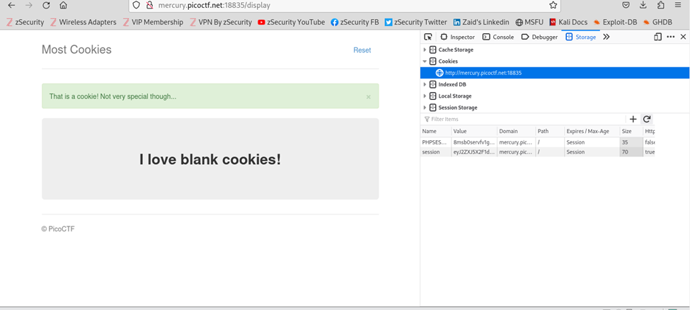
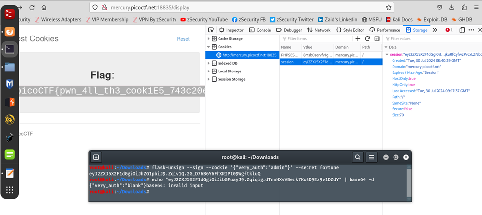

# Author: MADSTACKS
# Description:
Alright, enough of using my own encryption. Flask session cookies should be plenty secure! server.py http://mercury.picoctf.net:18835/
# Hints:
How secure is a flask cookie?
# Solutions:
The challenge gives us a link which opens a webpage with a "session" cookie that we will most likely have to modify.
## Thực hiện như sau:
1.  Thực hiện tải file server.py, sau đó thực hiện lệnh “vi server.py”:

2.	Tại đây, ta có thể thấy trang /display thể hiện thông tin về Flag khi ta tác động lên session[“very_auth”] nhưng lại có giá trị “blank”, không phải “admin”:

3. Thay đổi value tại name = “session” sau đó reload lại trang web, ta được kết quả về flag:
https://book.hacktricks.xyz/network-services-pentesting/pentesting-web/flask (sử dụng đường dẫn sau để biết thêm thông tin về flask-unsign)

**FLAG:**
> `picoCTF{pwn_4ll_th3_cook1E5_743c20eb}`
