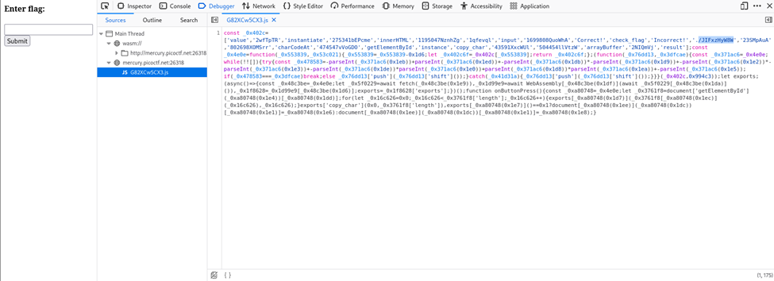
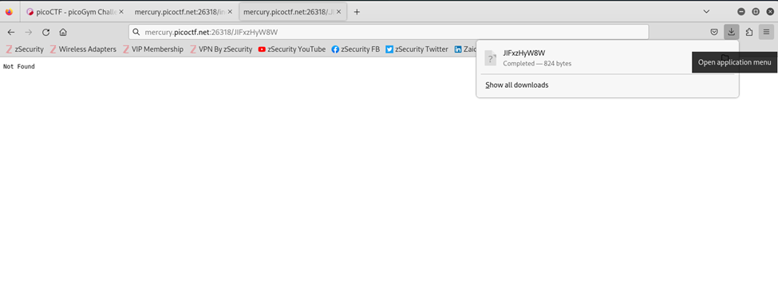
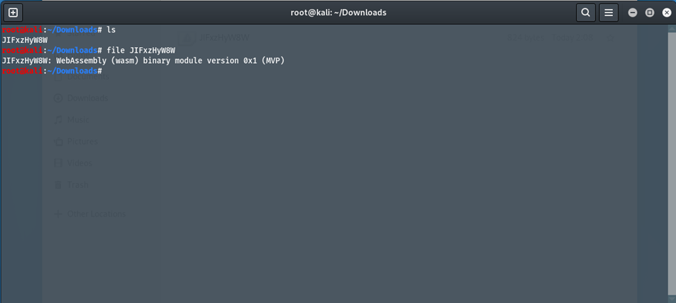
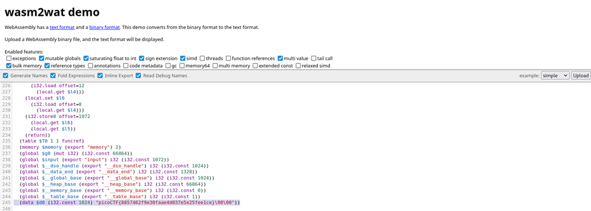

# Author: Sears Schulz
# Description:
http://mercury.picoctf.net:26318/index.html
# Hints:
None
# Solutions:
The challenge gives us a link directing to a webpage that allows us to guess the flag and check whether it is correct.
## Thực hiện như sau:
1.	Thực hiện Inspect (F12) tại trang web đó, sau đó chọn tab Debugger. Tại đây, ta thấy một file .js đặc biệt, tiến hành mở file ta được nội dung như sau:

2.	Tại file .js ta thấy một file ./JIFxzHyw8w. Tiến hành tải file đó:

3.	Dùng Terminal để kiểm tra, ta xác định được dạng file như sau:

4.	Sử dụng Web Browser để truy cập đường link để giải mã file JIFxzHyW8W: https://webassembly.github.io/wabt/demo/wasm2wat/

**FLAG:**
> `picoCTF{8857462f9ePhotos/30faae4d037e5e25fee1ce}`
