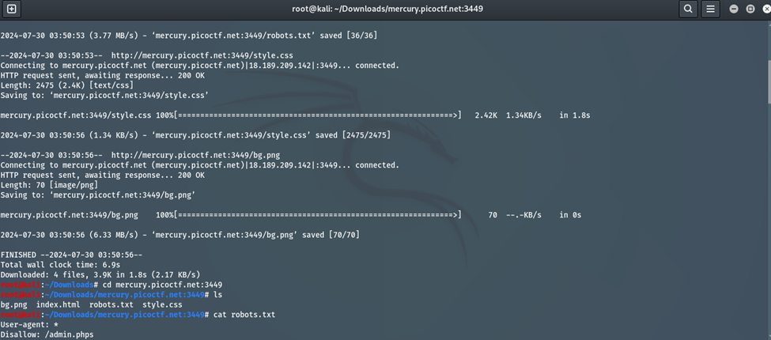
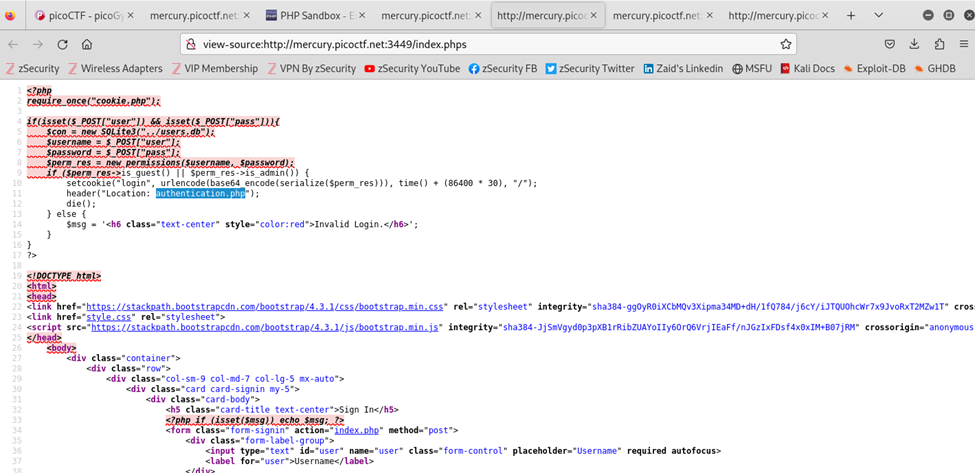
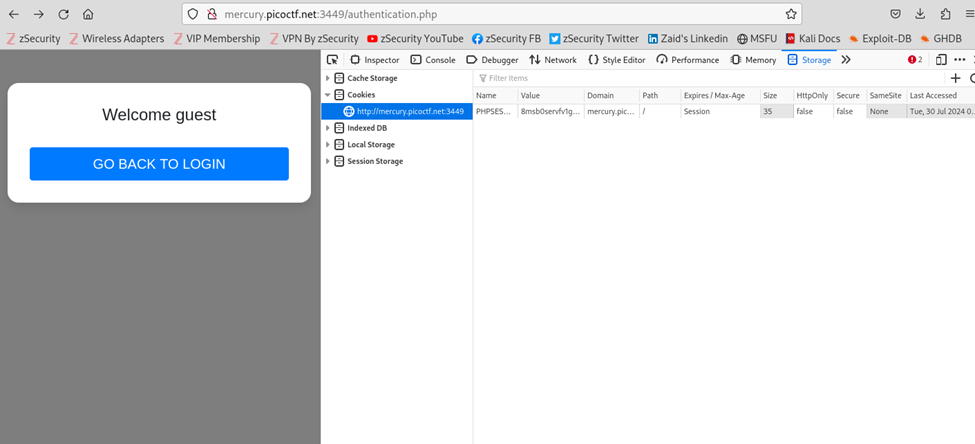
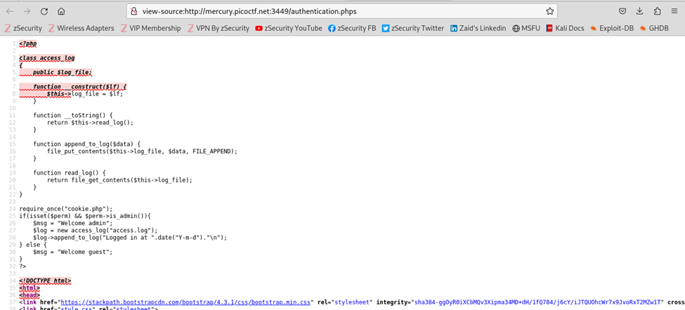
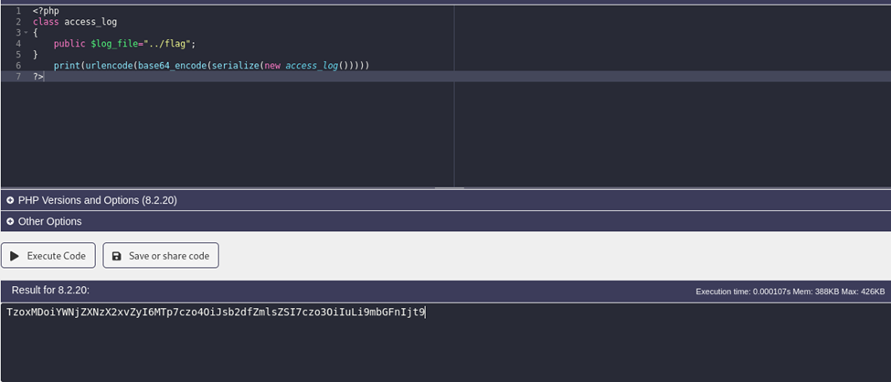
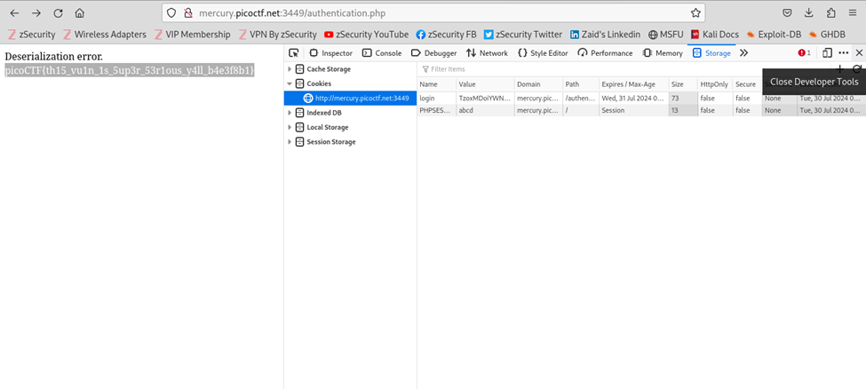

# Author: MadStacks
# Description:
Try to recover the flag stored on this website http://mercury.picoctf.net:3449/
# Hints:
The flag is at ../flag
# Solutions:
The challenge gives us a link which opens a webpage allowing us to login with a username and password. Doing some standard recoinassaince we find this robots.txt file:
## Thực hiện như sau:
1.	Dùng lệnh wget -r <link> để tải các file của trang web. Sau đó đọc nội dung trong file robots.txt, ta được thông tin:

2.	Từ đây ta thấy được trang web tạo từ PHP, sau đó ta truy cập thử file index.phps và được kết quả như sau:

3.	Ở trên, ta đã xác định được file authenticate.php sẽ chứa nội dung của Flag, ta thực hiện Inspect sau đó chuyển sang tab Storage để xem biến lưu trữ như sau:

4.	Tại bước 3, ta đã xác định được có thể tác động lên Cookie để tìm ra Flag nhưng phải tạo giá trị để thêm vào, vì vậy ta truy cập vào authentication.phps:

5.	Ta sẽ tạo một biến với name = ‘login’ và value =”…”:

6.	Thêm giá trị vào cookie của trang web sau đó reload,ta sẽ được nội dung như sau:

**FLAG:**
> `picoCTF{th15_vu1n_1s_5up3r_53e1ous_y4ll_b4e3f8b1}`
