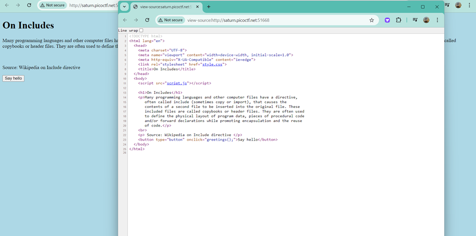
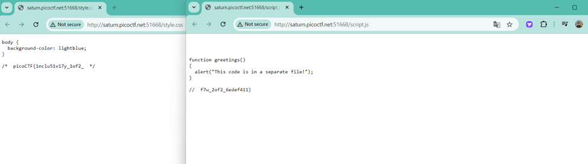

# Author: LT 'syreal' Jones
# Description:
Can you get the flag?Additional details will be available after launching your challenge instance. http://saturn.picoctf.net:51668/
# Hints:
Check out tools like Burp Suite to modify your requests and look at the responses
# Solutions:
Từ hai lựa chọn là Red hoặc Blue liên quan đến phương thức GET và POST, gửi yêu cầu đến trang web. Từ gợi ý của tên thử thách, chúng ta có thể kết luận rằng ta sẽ gửi một yêu cầu HEAD đến trang web để tìm ra flag. 
## Thực hiện như sau:
1.	Thực hiện View Page Source: 

2.	Từ đó, ta tìm được thông tin về Flag trong 2 file style.css và script.js. Truy cập 2 file ta được kết quả sau:

**FLAG:**
> `picoCTF{1nclu51v17y_1of2_f7w_2of2_6edef411}`
