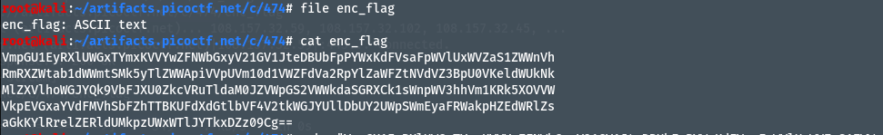

# Author: Theoneste Byagutangaza
# Description
Can you make sense of this file? Download the file here.
# Hints
Multiple decoding is always good.
# Solutions:
 Ở bài này, chúng ta cần phải biết định dạng nội dung trong file `enc_flag` là gì, và cần một tool python để giải mã liên tục nội dụng dạng đó.
 ## Thực hiện như sau:
1. Tải file `enc_flag` về bằng câu lệnh `wget -r https://artifacts.picoctf.net/c/474/enc_flag`.

2. Xem nội dung và định dạng file:

3. Viết chương trình giải mã base64, có đoạn code sau:
 >import base64
 >import sys
 >def decode_until_picoctf(encoded_string):
 >   decoded_string = encoded_string
 >   while True:
 >       try:
 >           decoded_string = base64.b64decode(decoded_string).decode('utf-8')
 >           if "picoCTF" in decoded_string:
 >               print("Found picoCTF!")
 >               print("Decoded string:", decoded_string)
 >               break
 >       except Exception as e:
 >           print("Decoding error:", e)
 >           break
>
>if __name__ == "__main__":
>    if len(sys.argv) != 2:
>        print("Usage: python3 encBase64.py <file_name>")
>        sys.exit(1)
>
>    input_string = sys.argv[1]
>    decode_until_picoctf(input_string) 
4. Ta được kết quả như sau:

# Flag:
> `picoCTF{base64_n3st3d_dic0d!n8_d0wnl04d3d_3f81f7be}`