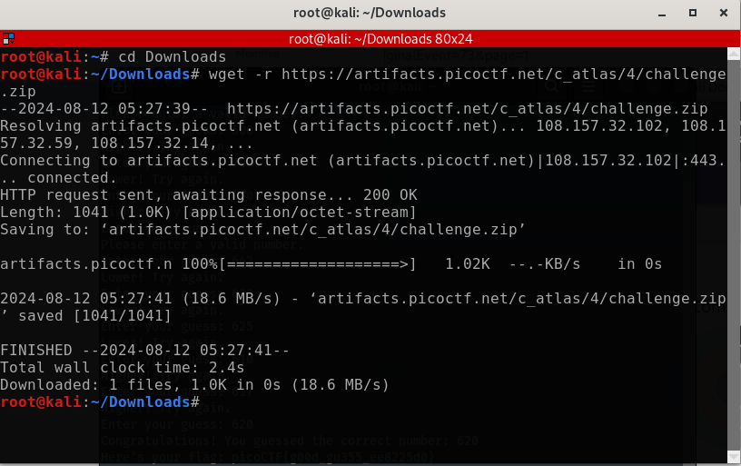
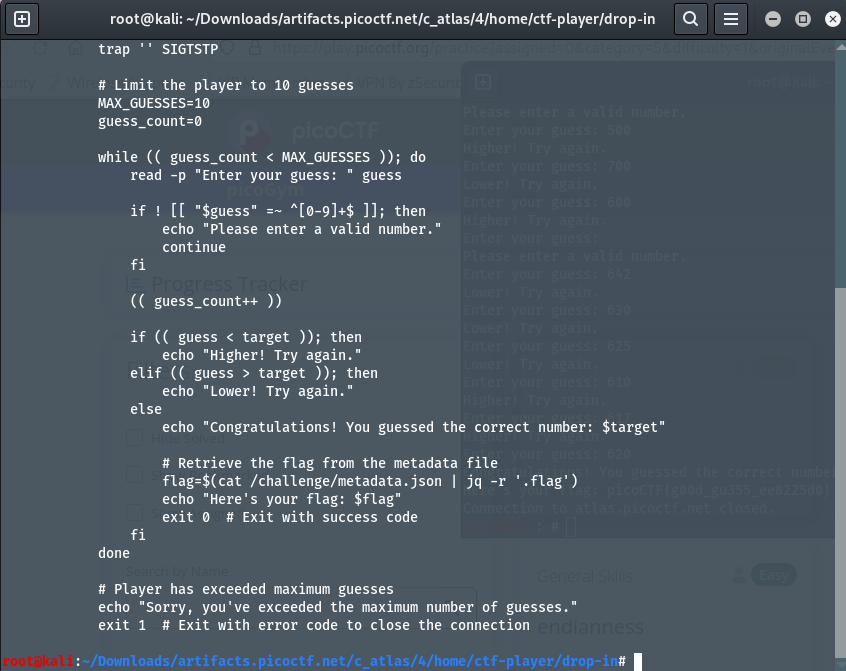
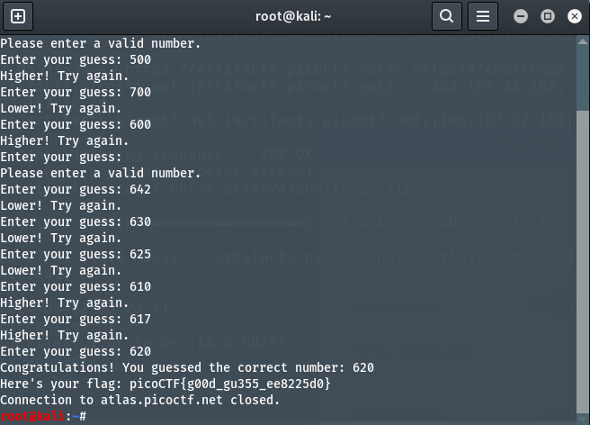

# Author: Jeffery John
# Description:
- Want to play a game? As you use more of the shell, you might be interested in how they work! Binary search is a classic algorithm used to quickly find an item in a sorted list. Can you find the flag? You'll have 1000 possibilities and only 10 guesses. 
- Cyber security often has a huge amount of data to look through - from logs, vulnerability reports, and forensics. Practicing the fundamentals manually might help you in the future when you have to write your own tools! 
- You can download the challenge files here:`challenge.zip`
Additional details will be available after launching your challenge instance.
`ssh -p 50088 ctf-player@atlas.picoctf.net`
- Using the password `83dcefb7`. Accept the fingerprint with `yes`, and `ls` once connected to begin. Remember, in a shell, passwords are hidden
# Hints:
1. Have you ever played hot or cold? Binary search is a bit like that.
2. You have a very limited number of guesses. Try larger jumps between numbers!
3. The program will randomly choose a new number each time you connect. You can always try again, but you should start your binary search over from the beginning - try around 500. Can you think of why?
# Solutions:
1. Thực hiện tải file `zip`:

2. Unzip file và đọc nội dung của file là một đoạn chương trình để đoán số:

3. Sử dụng đoạn `ssh -p 50088 ctf-player@atlas.picoctf.net` trong terminal để connect, sau đó tiến hành đoán số, ở đây ta đoán thủ công vì phạm vi số khá nhỏ, và dưới đây là kết quả:

# Flag:
> `picoCTF{g00d_gu355_ee8225d0}`