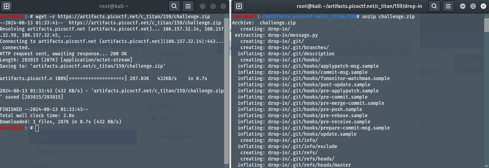
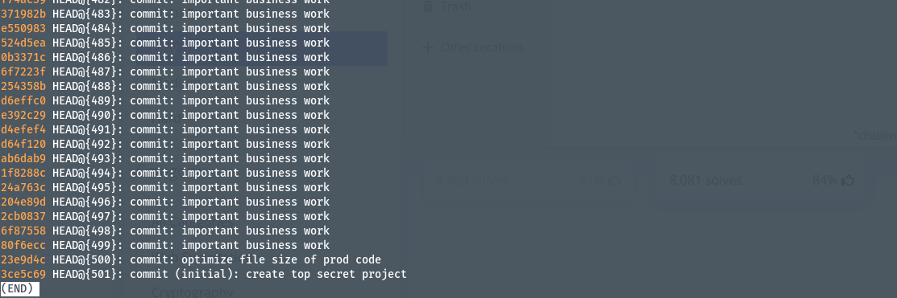
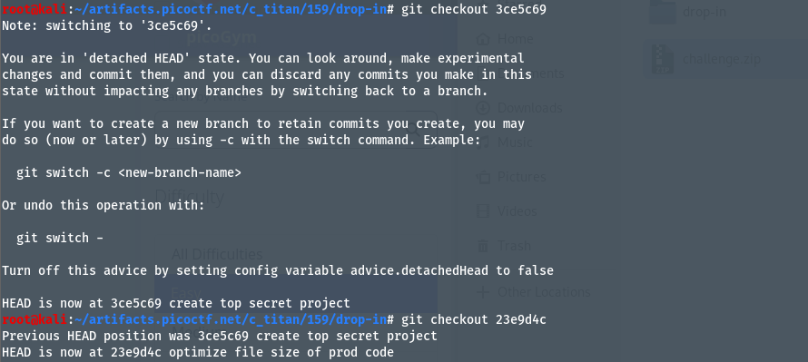
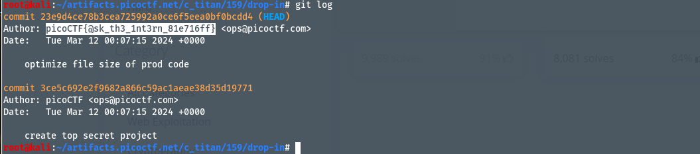

# Author: Jeffery John
# Description:
Someone's commits seems to be preventing the program from working. Who is it? You can download the challenge files here: `challenge.zip`
# Hints:
1. In collaborative projects, many users can make many changes. How can you see the changes within one file?
2. Read the chapter on Git from the picoPrimer here.
3. You can use python3 <file>.py to try running the code, though you won't need to for this challenge.
# Solutions:
Ở bài này, chúng ta thực hiện check `reflog` và `git branch -b` sau đó dùng `git log` để xem lại lịch sử commit.
 ## Thực hiện như sau:
1. Tải và unzip file `challenge.zip`:

2. Dùng lệnh `git reflog` để kiểm tra lịch sử:
 
3. Tại đây, ta thấy 2 branch `3ce5c69` và `23e9d4c` có chứa thông tin về flag, ta sẽ switch branch để tìm kiếm flag:

4. Dùng `git log` để check lịch sử đã commit từ trước:

# Flag:
> `picoCTF{@sk_th3_1nt3rn_81e716ff}`