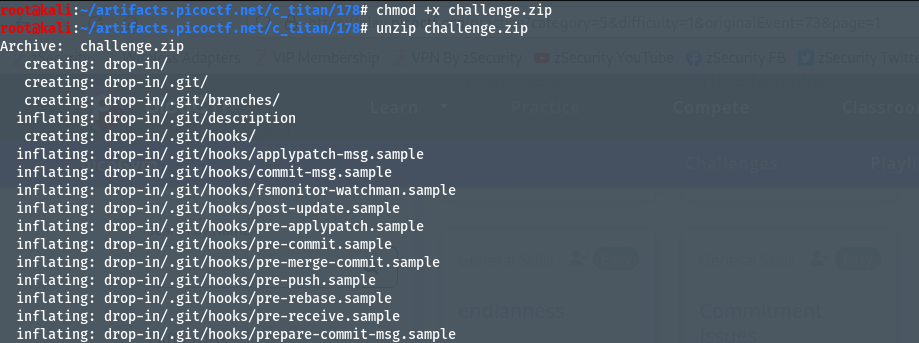
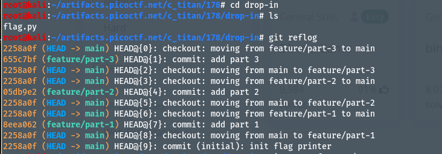
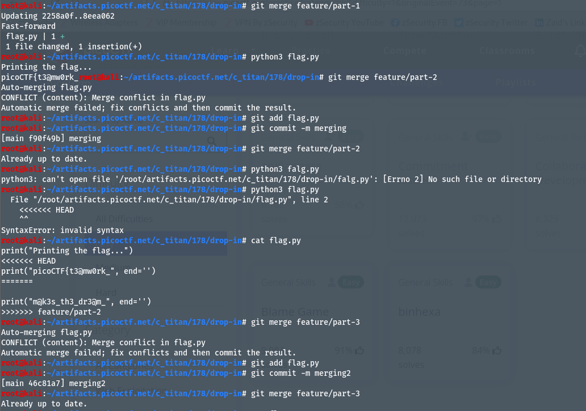
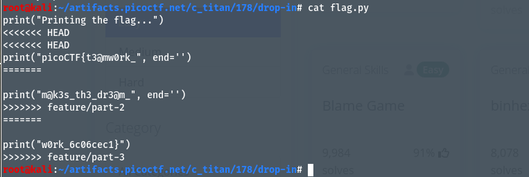

# Author: Jeffery John
# Description:
My team has been working very hard on new features for our flag printing program! I wonder how they'll work together? You can download the challenge files here: `challenge.zip`
# Hints:
1. git branch -a will let you see available branches
2. How can file 'diffs' be brought to the main branch? Don't forget to git config!
3. Merge conflicts can be tricky! Try a text editor like nano, emacs, or vim.
# Solutions:
 Ở bài này, ta thực hiện việc merge các branch và xử lí conflict khi merge.
 ## Thực hiện như sau:
1. Tải và unzip file `challenge.zip`:

2. Kiểm tra số lượng và dùng `git reflog` để kiểm tra lịch sử commit:

3. Thực hiện merge các branch bắt đầu từ `part-1` -> `part-2` -> `part-3`, nếu xảy ra conflict, ta dùng các lệnh push lại, từ `git add` -> `git commit` -> `git merge`:

4. Dùng lệnh `cat flag.py` để xem thông tin của flag đã được cập nhật sau khi merge:

# Flag:
>`picoCTF{t3@mw0rk_m@k3s_th3_dr3@m_w0rk_6c06cec1}`