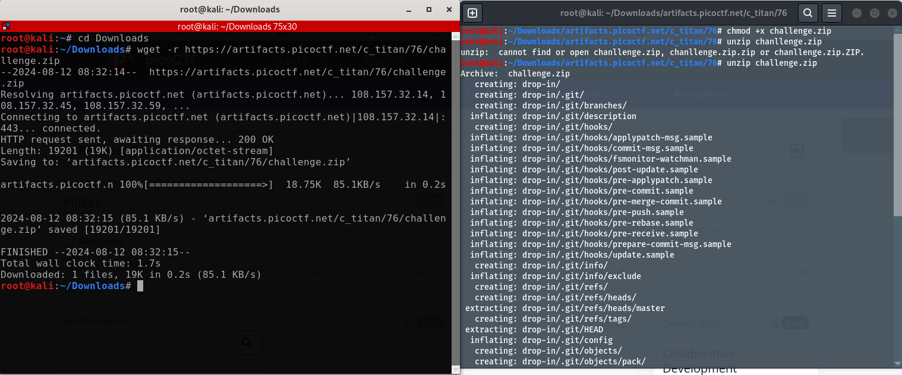
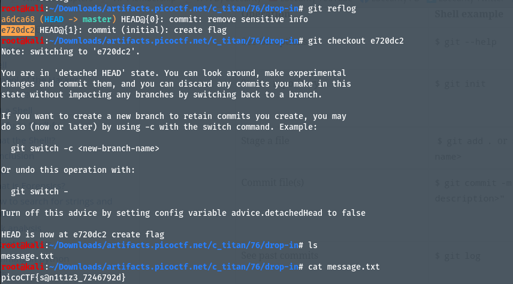

# Author: Jeffery John
# Description
I accidentally wrote the flag down. Good thing I deleted it! You download the challenge files here: `challenge.zip`
# Hints:
1. Version control can help you recover files if you change or lose them!
2. Read the chapter on Git from the picoPrimer here
3. You can 'checkout' commits to see the files inside them
# Solutions:
 ## Thực hiện như sau:
1. Tải và unzip file `challenge.zip`:

2. Ta thực hiện câu lệnh `git reflog`, để xem lịch sử log và commit của git. Lúc này ta thấy branch `e720dc2` chứa thông tin về flag, ta dùng lệnh `git checkout -b e720dc2` dể chuyển sang và truy cập file trong branch này. Dùng lệnh `ls` ta thấy có file nội dung `message.txt`, dùng `cat` để xem file .txt này, ta nhận được:

# Flag:
> `picoCTF{s@n1t1z3_7246792d}`