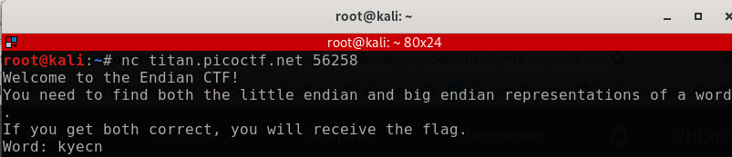
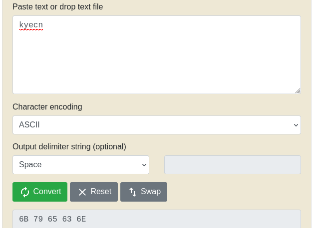
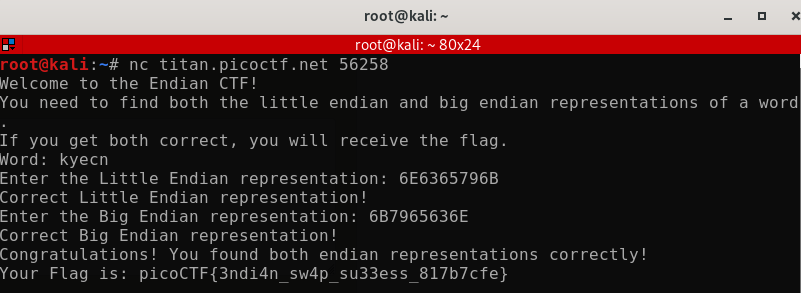

# Author: Nana Ama Atombo-Sackey
# Description:
Know of little and big endian? Source
# Hints:
1. You might want to check the ASCII table to first find the hexadecimal representation of characters before finding the endianness.
2.  Read more about how endianness here
# Solutions:
 Ở bài này, ta phải định nghĩa được Little Endian và Big Endian để sắp xếp giá trị.
 - Little Endian: giá trị có trọng số thấp nhất -> trọng số cao nhất
 - Big Endian: giá trị có trọng cao nhất -> giá trị có trọng số thập nhất
  ## Thực hiện như sau:
1. Chạy câu lệnh `nc titan.picoctf.net 56258`, thực hiện kết nối netcat trong terminal:

2. Sau khi kết nối thành công, ta nhận được `kyecn` dưới dạng ASCII, ta cần chuyển đổi sang dạng HEX bằng tools: `https://www.rapidtables.com/convert/number/ascii-to-hex.html`.

3. Nhập Little Endian và Big Endian, ta được kết quả của Flag:

# Flag:
> `picoCTF{3ndi4n_sw4p_su33ess_817b7cfe}`