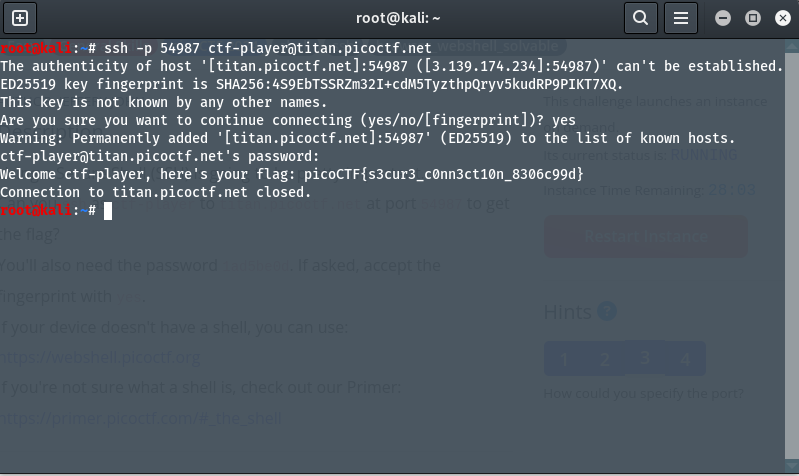

# Author: Jeffery John
# Description:
- Using a Secure Shell (SSH) is going to be pretty important. 
- Can you `ssh` as `ctf-player` to `titan.picoctf.net` at port `54987` to get the flag? You'll also need the password `1ad5be0d`. If asked, accept the fingerprint with yes. If your device doesn't have a shell, you can use: `https://webshell.picoctf.org` If you're not sure what a shell is, check out our Primer: `https://primer.picoctf.com/#_the_shell`
# Hints:
1. https://linux.die.net/man/1/ssh
2. You can try logging in 'as' someone with <user>@titan.picoctf.net
3. How could you specify the port?
4. Remember, passwords are hidden when typed into the shell
# Solutions:
 ## Thực hiện như sau:
 Ở bài này, ta cần kết nối SSH là tìm được thông tin về Flag. Ta sử dụng câu lệnh `ssh -p 54987 ctf-player@titan.picoctf.net`: 

# Flag:
> `picoCTF{s3cur3_c0nn3ct10n_8306c99d}`