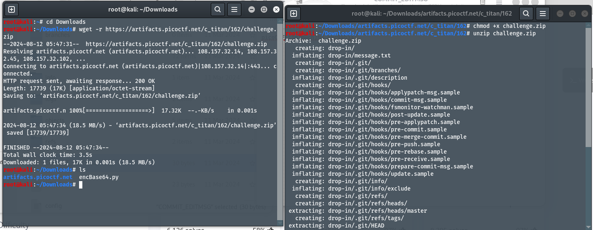
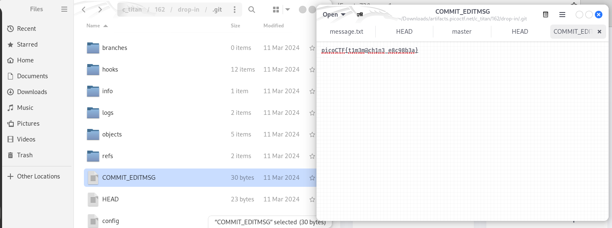

# Author: Jeffery John
# Descripti:
What was I last working on? I remember writing a note to help me remember... You can download the challenge files here: `challenge.zip`
# Hints:
1. The cat command will let you read a file, but that won't help you here!
2. Read the chapter on Git from the picoPrimer here.
3. When committing a file with git, a message can (and should) be included.
# Solutions:
 Ở bài này, ta cần tìm kiến flag ở các file lịch sử khi commit lên git.
 ## Thực hiện:
1. Thực hiện tải file và unzip:

2. Đọc thông tin từng file, ta thấy mục `COMMIT_EDITMSG` có chứa thông tin về flag:

# Flag:
> `picoCTF{t1m3m@ch1n3_e8c98b3a}`