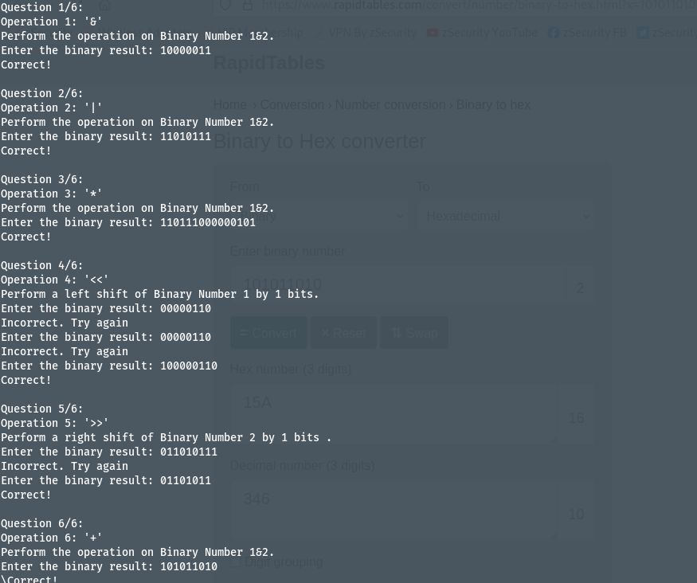
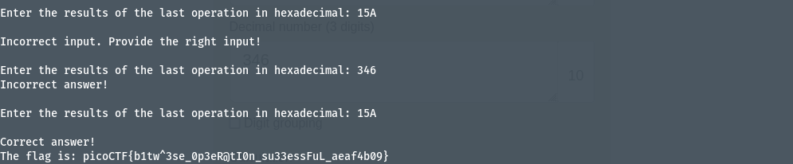

# Author: Nana Ama Atombo-Sackey
# Description:
How well can you perfom basic binary operations?
Additional details will be available after launching your challenge instance
# Hints: 
None
# Solutions:
Ở bài này, ta cần thực hiện các phép tính toán giữa 2 số nhị phân 8 bit và sau cùng chuyển đổi sang hexadecimal. Trình bày dưới đây:

# Flag:
> `picoCTF{b1tw^3se_0p3eR@tI0n_su33essFuL_aeaf4b09}`