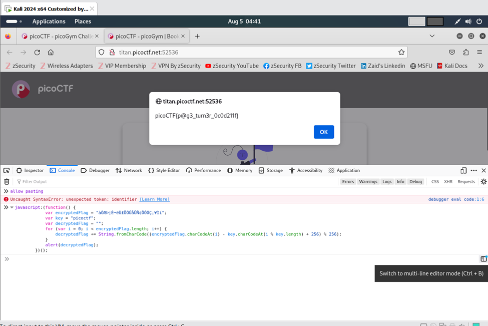

# Author: Jeffery John
# Description:
Why search for the flag when I can make a bookmarklet to print it for me?
Additional details will be available after launching your challenge instance.
# Hints:
1.	A bookmarklet is a bookmark that runs JavaScript instead of loading a webpage.
2.	What happens when you click a bookmarklet?
3.	Web browsers have other ways to run JavaScript too.
# Solutions:
    Thực hiện như sau:
Thực hiện View Page Source để tìm đoạn javascript cần thực thi, sau đó Inspector(F12) và mở tab Console, dán đoạn javascript vừa tìm được và nhần Enter. Và đây là kết quả.

**FLAG:**
> `picoCTF{p@g3_turn3r_0c0d211f}`
