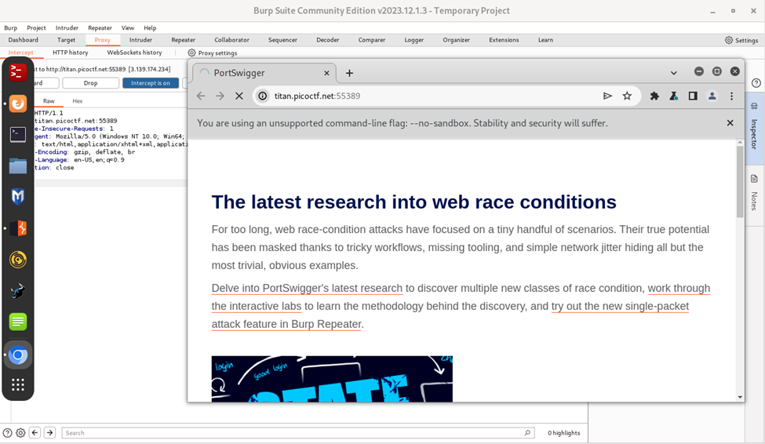
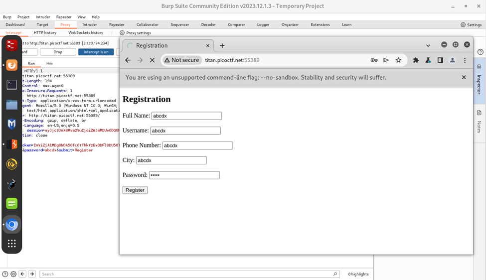
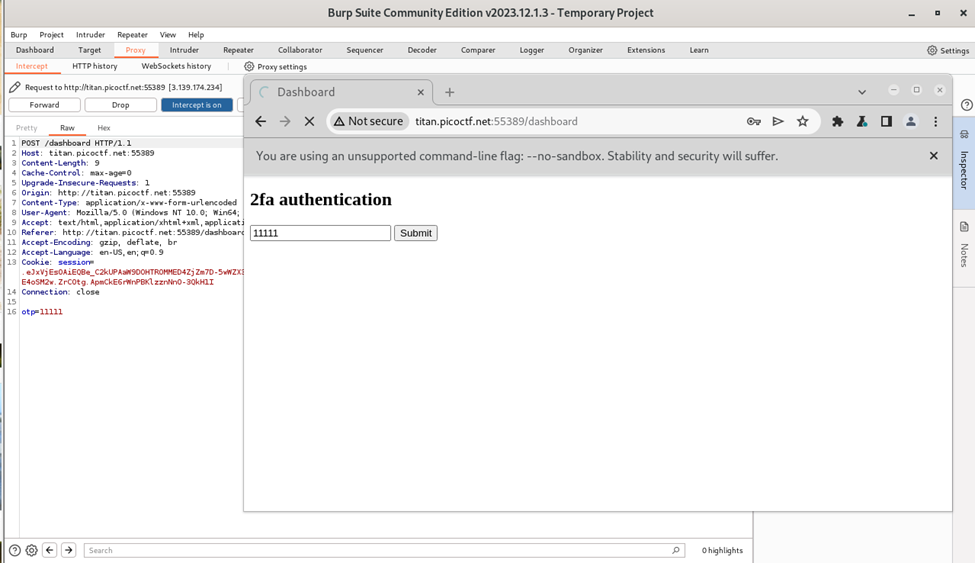
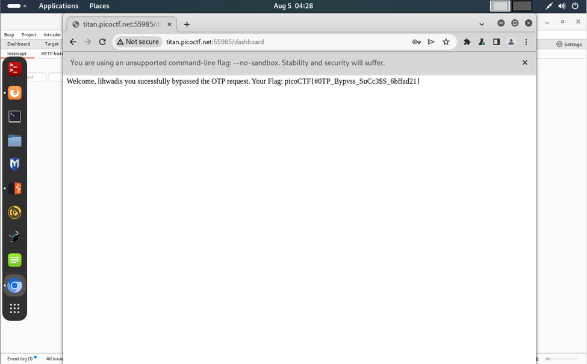

# Author: Nana Ama Atombo-Sackey & Sabine Gisagara
# Description:
Additional details will be available after launching your challenge instance. http://titan.picoctf.net:54693/
# Hints:
1.	Try using burpsuite to intercept request to capture the flag.
2.	Try mangling the request, maybe their server-side code doesn't handle malformed requests very well.
# Solutions:
Hướng đi: Ta sẽ dùng phần mềm Burp Suite sau đó Forward liên tiếp để theo dõi hoạt động của client-server.
## Thực hiện như sau:
1.	Dùng Burp Suite để truy cập đường link

2.	Sau đó, nhập các thông tin sau:

3.	Thực hiện Forward liên tục đến khi xuất hiện OTP:

4.	Thực hiện xóa dòng “otp=11111” và FORWARD tiếp và sẽ được kết quả:

**FLAG:**
> `picoCTF{#0TP_Bypvss_SuCc3$S_6bffad21}`
