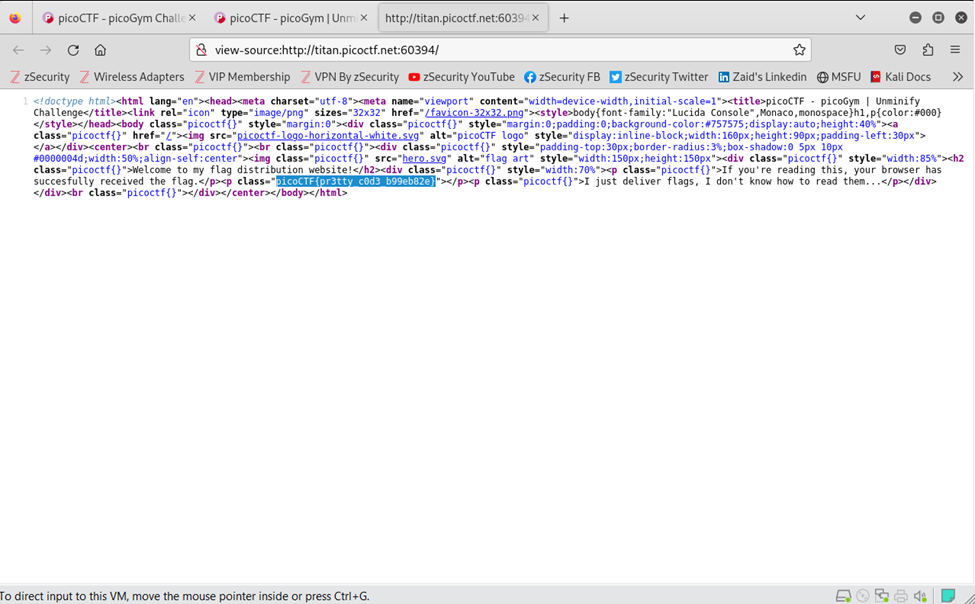

# Author: Jeffery John
# Description:
I don't like scrolling down to read the code of my website, so I've squished it. As a bonus, my pages load faster! Additional details will be available after launching your challenge instance. https://titan.picoctf.net:60394
# Hints:
1.	Try CTRL+U / ⌘+U in your browser to view the page source. You can also add 'view-source:' before the URL, or try curl <URL> in your shell.
2.	Minification reduces the size of code, but does not change its functionality.
3.	What tools do developers use when working on a website? Many text editors and browsers include formatting.
# Solutions:
    Thực hiện như sau:
Thực hiện View Page Source: 

**FLAG:**
> `picoCTF{pr3tty c0d3 b99eb82e}`
